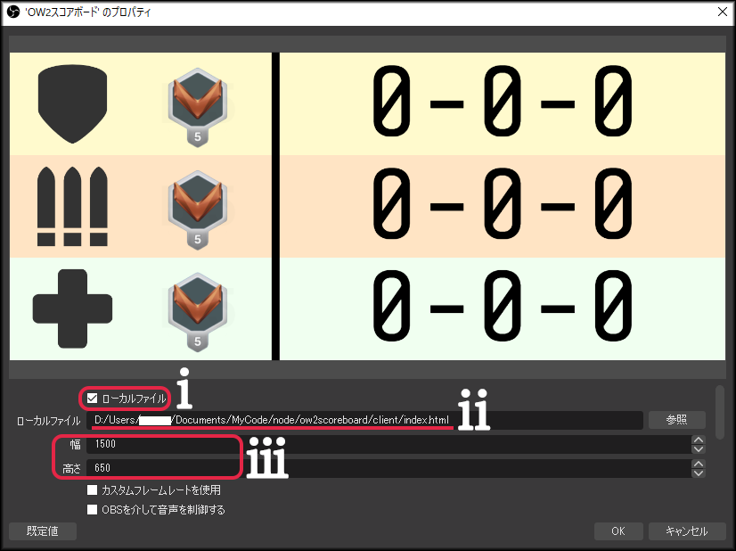

# Overwatch2 スコアボードオーバーレイ

## 機能

* 各ロール（タンク，DPS，サポート）ごとの戦績とレートの表示と管理が可能
* 各ロールの表示切替が可能
* 一度アプリを閉じても再度起動すればスコアを復元可能
* スコアの最終更新日時が表示されるので，更新したかわからなくなった時の判断材料として使えます
* （Version2.0.0以降）認定ごとにスコアを管理する事が可能
* （Version2.0.0以降）それまでの総合の戦績と最新の認定での戦績を交互に表示

## 内容

|コントローラー|オーバーレイ|
|---|---|
|||

## 導入手順

1. こちらの[リリースページ](https://github.com/Lait-au-Cafe/ow2scoreboard/releases)から最新版の **ow2scoreboard_Setup_バージョン番号.zip** をダウンロードして解凍
2. OBSで **client/index.html** をブラウザソースとしてキャプチャ
    1. 最上部の「ローカルファイル」にチェックをつけます．
    2. 「参照」から，解凍したフォルダ内にあるclientという名前のフォルダ内のindex.htmlという名前のファイルを指定します．
    3. 縦並べ表示の場合は「幅」を1500・「高さ」を650，横並べ表示の場合は「幅」を1500・「高さ」を72とします[^1]．「幅」の値を小さくするとスコア部分の横幅を狭くできますが，狭くし過ぎるとスコアが2桁になったときにはみ出るので注意してください．

3. **ow2scoreboard Setup バージョン番号.exe** を実行してコントローラーをインストールおよび起動

> **Note**
> コントローラーのショートカットなどは作成されないため，最初の起動時にピン止めをしたりショートカットを作成しておくと便利です．忘れた場合にはもう一度 **ow2scoreboard Setup バージョン番号.exe** を実行すれば開けます．

[^1]: 縦並べ表示と横並べ表示の切り替えはキャプチャをする際に指定する高さが100px未満かそうでないかで行っています．本来であればアスペクト比を用いるべきところですが，OBSが内部で使用しているブラウザがなぜかアスペクト比によるスタイルの切り替えをサポートしていないためこのような次善策をとっています．